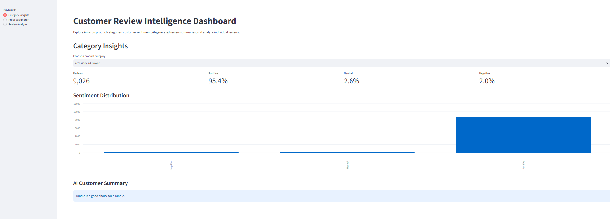
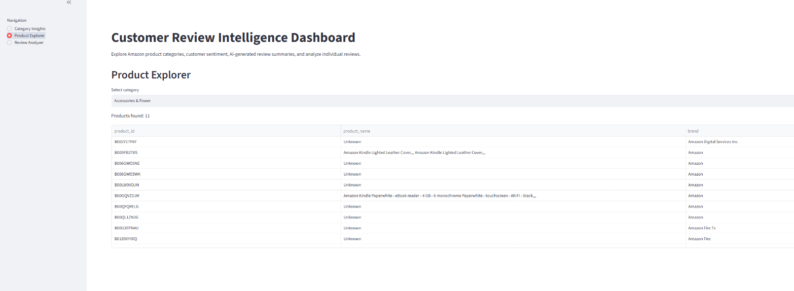
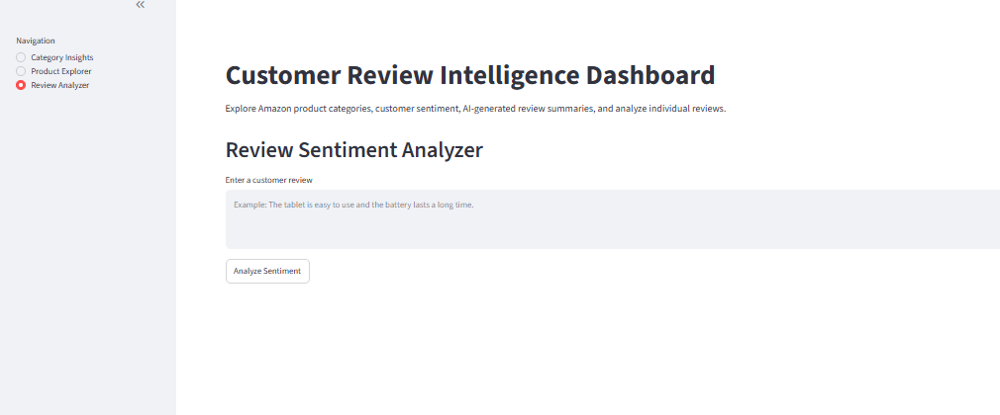

# Customer Review Intelligence Dashboard

An NLP-based application for analyzing Amazon customer reviews using sentiment analysis, product clustering, and generative AI summarization.

The project was developed as part of the Ironhack NLP Customer Reviews project.

## Live Application

🚀 **Streamlit App:**  
https://customerreviewproject-n7miuckjup3npneptcqbr8.streamlit.app/

---

## Project Overview




Online stores can contain thousands of customer reviews, making it difficult to manually understand customer opinions.

This project uses Natural Language Processing (NLP) to transform customer reviews into useful business insights.

The application provides:

- Sentiment analysis of customer reviews
- Product grouping using clustering
- AI-generated category summaries
- Product exploration by category
- Interactive sentiment analysis for new user reviews

---

## Dataset

The project uses an Amazon customer review dataset.

After preprocessing, the main working dataset contains:

- **34,624 cleaned reviews**
- **38 unique products**
- Product names and IDs
- Ratings
- Review text
- Brand information
- Product categories

Customer ratings were converted into three sentiment classes:

| Rating | Sentiment |
|---|---|
| 1–2 | Negative |
| 3 | Neutral |
| 4–5 | Positive |

The dataset is strongly imbalanced toward positive reviews.

---

## Project Pipeline

```text
Amazon Reviews
      |
      v
Data Cleaning & EDA
      |
      v
Sentiment Analysis
      |
      +---- TF-IDF + Logistic Regression
      |
      +---- Pretrained Amazon DistilBERT
      |
      +---- Fine-tuned DistilBERT
      |
      v
Best Sentiment Model
      |
      v
Product Clustering
      |
      +---- TF-IDF
      +---- KMeans
      |
      v
6 Product Meta-Categories
      |
      v
FLAN-T5-small
      |
      v
AI Review Summaries
      |
      v
Streamlit Application
      |
      v
Deployment
```

---

## 1. Sentiment Analysis

The first NLP task was to classify reviews into:

- Negative
- Neutral
- Positive

Three approaches were evaluated.

### TF-IDF + Logistic Regression

A traditional NLP baseline was created using:

- `TfidfVectorizer`
- Logistic Regression
- Balanced class weights

Validation results:

| Model | Accuracy | Macro F1 |
|---|---:|---:|
| TF-IDF + Logistic Regression | 0.8708 | 0.51 |

---

### Pretrained Amazon DistilBERT

A pretrained Hugging Face sentiment model was evaluated:

`SebasLopez-ai/distilbert-amazon-reviews-sentiment`

Validation results:

| Model | Accuracy | Macro F1 |
|---|---:|---:|
| Pretrained Amazon DistilBERT | 0.8922 | 0.60 |

This model performed better on the minority Negative and Neutral classes and was selected as the final sentiment model.

Final test results:

- **Accuracy: ~89.5%**
- **Macro F1: ~0.63**

---

### Fine-tuned DistilBERT

A separate `distilbert-base-uncased` model was fine-tuned using a balanced training subset.

Validation results:

| Model | Accuracy | Macro F1 |
|---|---:|---:|
| Fine-tuned DistilBERT | 0.8279 | 0.53 |

Balancing improved recall for Negative and Neutral reviews, but reduced overall precision and accuracy.

---

## 2. Product Clustering

The project also groups similar products into broader product categories.

### Why clustering?

The original category information contains many long and overlapping category labels.

Clustering helps simplify the product catalog into a smaller number of meaningful groups.

### Method

Product information was transformed using:

- Product name
- Existing category information
- TF-IDF vectorization
- KMeans clustering

Different cluster counts were tested using the Silhouette Score.

After improving the text representation, the results were approximately:

| Number of Clusters | Silhouette Score |
|---:|---:|
| 4 | 0.2313 |
| 5 | 0.2601 |
| 6 | **0.2673** |

Six clusters were selected.

The resulting business-friendly meta-categories include:

- Accessories & Power
- Fire Tablets - Standard
- Kindle Fire 16GB Tablets
- Echo & Smart Home
- Fire HD Tablets
- Kindle Voyage / E-readers

---

## 3. Generative AI Summarization

Customer reviews can be difficult to understand when thousands of reviews exist for one category.

To create short customer insights, the project uses:

`google/flan-t5-small`

from the Hugging Face model hub.

Reviews are sampled from Positive, Neutral, and Negative sentiment groups and provided to the generative model.

The generated summaries are stored in:

```text
category_summaries.json
```

For the current V1 application, summaries are generated offline and loaded by the Streamlit application.

This keeps the deployed application lightweight and fast.

---

## 4. Streamlit Application

The deployed application contains three main sections.

### Category Insights

Users can select one of the generated product categories and view:

- Number of reviews
- Positive review percentage
- Neutral review percentage
- Negative review percentage
- Sentiment distribution
- AI-generated customer summary

### Product Explorer

Users can select a category and explore the products assigned to that cluster.

Displayed information includes:

- Product ID
- Product name
- Brand

### Review Sentiment Analyzer

Users can enter a new customer review.

The application sends the review to the pretrained Amazon DistilBERT model and returns:

- Predicted sentiment
- Prediction confidence

Example:

```text
Input:
"This product is very easy to use and works perfectly."

Output:
Sentiment: Positive
Confidence: 95%
```

---

## Application Architecture

The V1 application uses a combination of offline processing and live model inference.

```text
Notebook / ML Pipeline
        |
        +---- Product Clustering
        |          |
        |          v
        |     products.csv
        |
        +---- Processed Reviews
        |          |
        |          v
        |     app_reviews.csv
        |
        +---- FLAN-T5 Summaries
                   |
                   v
          category_summaries.json


               Streamlit App
                    |
        +-----------+-----------+
        |           |           |
        v           v           v
   CSV Data     JSON Data   DistilBERT
                              |
                              v
                       Live Sentiment
                        Prediction
```

Clustering and summarization are currently performed offline.

Sentiment prediction is performed live when a user submits a new review.

---

## Project Structure

```text
CustomerReviewproject/
│
├── app.py
├── README.md
├── requirements.txt
├── category_summaries.json
│
├── data/
│   ├── app_reviews.csv
│   └── products.csv
│
├── notebooks/
│   └── main.ipynb
│
├── src/
└── .gitignore
```

---

## Technologies Used

- Python
- Pandas
- NumPy
- Scikit-learn
- TF-IDF
- Logistic Regression
- KMeans
- Hugging Face Transformers
- DistilBERT
- FLAN-T5
- PyTorch
- Streamlit
- Git / GitHub

---

## Run Locally

Clone the repository:

```bash
git clone <https://github.com/rayhanpatoary/CustomerReviewproject.git>
cd CustomerReviewproject
```

Create a virtual environment:

```bash
python -m venv .venv
```

Activate it on Windows:

```bash
.\.venv\Scripts\Activate.ps1
```

Install dependencies:

```bash
python -m pip install -r requirements.txt
```

Run the application:

```bash
python -m streamlit run app.py
```

Then open:

```text
http://localhost:8501
```

---

## Deployment

The V1 application is deployed using **Streamlit Community Cloud**.

The deployed application loads processed CSV/JSON artifacts from the repository and downloads the pretrained sentiment model from Hugging Face when needed.

---

## Known Limitations

This is the first working version of the application.

Current limitations include:

- The dataset is highly imbalanced toward Positive reviews.
- FLAN-T5-small may sometimes generate overly short or generic summaries.
- Product clustering uses TF-IDF and KMeans instead of semantic embeddings.
- Some original product names are missing from the dataset.
- AI summaries are pre-generated rather than generated dynamically.
- The product dataset contains a relatively small number of unique products.
- The first live sentiment prediction can be slower while the Hugging Face model loads.

---

## Future Improvements

Possible V2 improvements include:

- Use a stronger generative summarization model
- Improve prompts and summary quality
- Use sentence-transformer embeddings for semantic clustering
- Improve product category quality
- Add product recommendation/ranking
- Add product search
- Generate summaries dynamically
- Improve the Streamlit UI
- Add user feedback
- Add database storage
- Separate frontend and ML backend
- Build a Next.js frontend with a FastAPI ML API
- Deploy a more production-oriented architecture

---

## Development Philosophy

The goal of V1 was to build and deploy a complete end-to-end NLP application first.

The system can then be improved iteratively based on model performance and user experience.

```text
Build → Deploy → Test → Learn → Improve
```